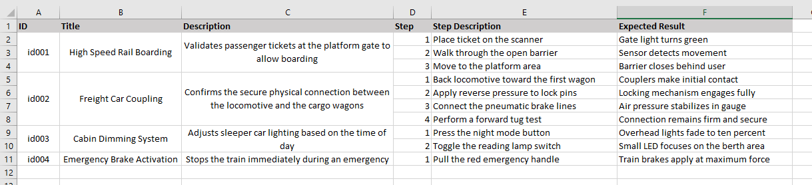
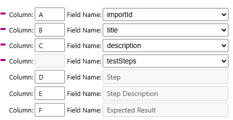
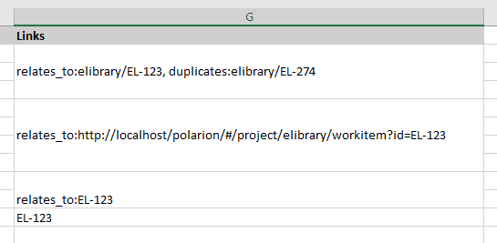

* [Test Steps table import](#test-steps-table-import)
* [Linked work items](#linked-work-items)
* [Velocity functions](#velocity-functions)


## Test steps table import
It is possible to import test steps table. To do this, the file should have a specific structure: all non-table cells must be merged e.g.:



The mapping configuration for the example above should look like this:



## Linked work items
In order to link imported work items using 'linkedWorkItems' field the cell must contain a comma-separated list of work item IDs together with the optional link role and project ID (e.g. `link_role:project_id/WI_ID`) or using full link to the work item:



## Velocity functions

### Convert HTML table to XLSX
It is possible to generate xlsx document from existing html table in a LiveDoc or Wiki by adding code like this:
```html
$excelTool.init()
<p>
<input type="button" onclick="$excelTool.exportHtmlTable('users-table', 'Users', 'UsersData')" value="Export to Excel">
</p>
<table id="users-table">
   <tr>
      <th style="font-weight: bold">Name</th>
      <th xlsx-width="300">Phone number</th>
   </tr>
   <tr style="color: #22CC66" xlsx-height="200">
      <td>John Doe</td>
      <td>555-12-34</td>
   </tr>
   <tr>
      <td>Ann Smith</td>
      <td>555-09-87</td>
   </tr>
</table>

```
In the above case extension generates the file `UsersData.xlsx` with the data from table `users-table` on the sheet `Users`.

Supported custom attributes:

| Attribute      | Description                                                                   |
|----------------|-------------------------------------------------------------------------------|
| xlsx-width     | Width for the column (approx. value in pixels). Can be put on 'th' tags only. |
| xlsx-height    | Height for the row (approx. value in pixels). Can be put on 'tr' tags only.   |
| xlsx-cell-type | Cell type. Supported values: 'auto' (default), 'text', 'link', 'image'.       |

Cell type details: cells default to the 'auto' type, letting the extension automatically identify the correct type. For complex content, like nested or multiple HTML tags, specifying the type explicitly is recommended.

Supported style properties:

| Property         | Description                                                                                                                                                                                        |
|------------------|----------------------------------------------------------------------------------------------------------------------------------------------------------------------------------------------------|
| color            | Font color. Supported formats: hex (#RRGGBB) or [CSS named colors](https://www.w3.org/TR/css-color-3/#svg-color) (e.g., 'red', 'blue', 'darkslategray'). Color names are case-insensitive.         |
| background-color | Cell background color. Supported formats: hex (#RRGGBB) or [CSS named colors](https://www.w3.org/TR/css-color-3/#svg-color) (e.g., 'red', 'blue', 'lightgreen'). Color names are case-insensitive. |
| font-weight      | Bold font when value = 'bold' or integer value >= 700                                                                                                                                              |

Color support details:
- All 147 [CSS Color Module Level 3](https://www.w3.org/TR/css-color-3/) named colors are supported
- Color names are case-insensitive (e.g., 'Red', 'RED', and 'red' are all valid)
- Both hex format (#RRGGBB) and named colors can be used interchangeably
- Includes all [HTML 4.01 color keywords](https://www.w3.org/TR/css-color-3/#html4) and [SVG color keywords](https://www.w3.org/TR/css-color-3/#svg-color)

### Attach a table to an entity
```velocity
$excelTool.attachTable($tableHtml, $workItem, 'attached_table.xlsx', 'Test table')
```

### Create html table from the given data
```velocity
#set($testData = [
    ["ID", "Title", "Status", "Priority", "Assignee"],
    ["WI-001", "Implement login feature", "In Progress", "High", "John Doe"],
    ["WI-002", "Fix navigation bug", "Open", "Critical", "Jane Smith"],
    ["WI-003", "Update documentation", "Done", "Low", "Bob Johnson"],
    ["WI-004", "Performance optimization", "In Progress", "Medium", "Alice Williams"],
    ["WI-005", "Add unit tests", "Open", "High", "Charlie Brown"]
])
$excelTool.getHTMLTable($testData)
```

### Creates the export configuration for a table
```velocity
#set(configuration = $excelTool.getTableExportConfiguration($workItems, $query, $charset, $fields, $template, $params, $contextId))
```

### Waits until IExport has status finished
```velocity
$excelTool.waitForExport($export, $timeoutSeconds)
```
